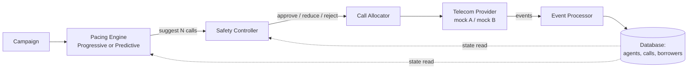
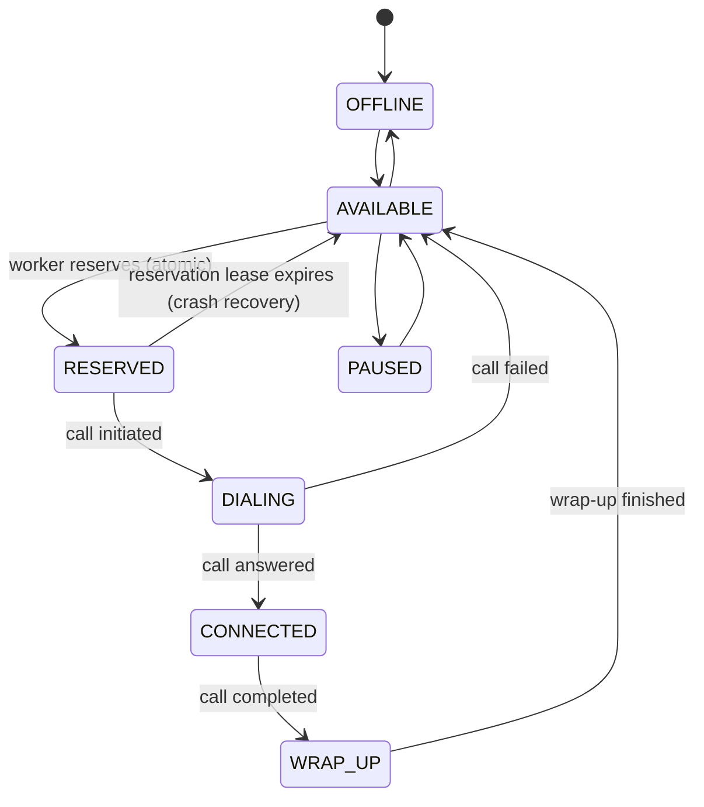
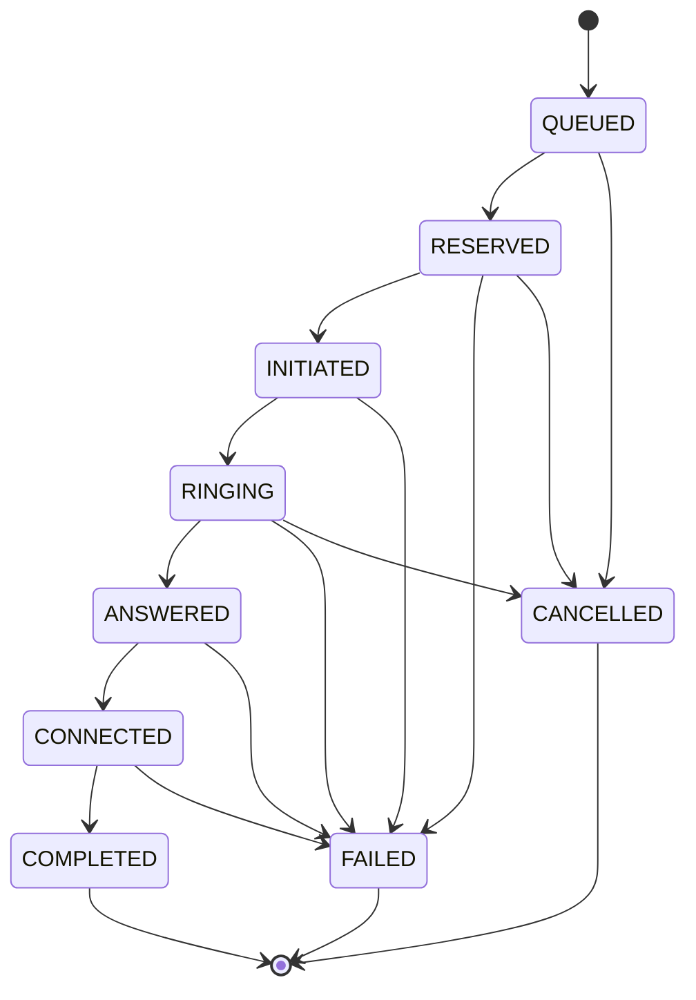

# SmartDialer

A working prototype of a collections-call SmartDialer, built around one non-negotiable rule:
**an abandoned connected call is a compliance incident, not just a bad experience — so no pacing
logic is ever allowed to place a call directly.**

Everything flows through a single choke point, the **Safety Controller**, before anything reaches
the telecom layer.

## Quick start

No external services, no installs beyond Python itself. Uses SQLite (a local file), so there is
nothing to provision.

```bash
git clone <this repo>
cd smartdialer
python3 run_all.py
```

That single command:
1. runs all unit/integration tests (concurrency, idempotency, out-of-order events, crash recovery,
   safety controller, state machine, predictive pacing)
2. runs the required scenario matrix (A/B/C/D)
3. runs the provider outage scenario
4. runs the sudden agent-drop scenario
5. runs a basic load test
6. runs a Predictive vs Progressive side-by-side comparison

Requires Python 3.10+. No third-party packages needed — everything uses the standard library
(`sqlite3`, `threading`).

## Project layout

```
run_all.py                     entry point — runs everything
smartdialer/
  models.py                    schema, agent/call state tables, transition rules
  providers.py                 mock telecom providers (Provider A, Provider B)
  safety_controller.py         the mandatory gate before any real dial
  pacing_progressive.py        Progressive Dialer
  pacing_predictive.py         Predictive Pacing Engine
  allocator.py                 atomic agent/borrower reservation, call creation
  event_processor.py           idempotent, order-safe call state updates
  lease_sweeper.py             crash recovery (reclaims stuck reservations)
  worker.py                    one dialer worker's loop
  simulation.py                wires everything together for a single run
  scenarios.py                 scenario matrix, outage test, agent-drop test, load test
  tests/                       unit and integration tests
ARCHITECTURE.md                why these choices, what they cost, what breaks first
```

## Why SQLite, not Postgres/Redis/Kafka for the prototype

The assignment explicitly says not to reach for infrastructure that "sounds impressive" without
justifying it. This prototype's correctness comes from **one mechanism**: an atomic conditional
`UPDATE ... WHERE state = 'AVAILABLE'`. SQLite supports that mechanism identically to Postgres, so
for a local prototype it removes any setup step without weakening the thing actually being tested.

See `ARCHITECTURE.md` for the full reasoning, including exactly where SQLite stops being enough
and what I'd swap in.

## The pipeline



The Pacing Engine can only say a number. It has no reference to the provider or the allocator.
The Safety Controller is the only component that can turn a suggestion into a real dial, and it
always re-checks against the database's current agent count — regardless of what the pacing
engine asked for.

## Agent state machine



## Call state machine



Any event that doesn't match an arrow on this diagram is dropped by the Event Processor, not
applied. This is what keeps the system consistent when the provider sends events out of order,
duplicated, or in an unexpected sequence — see `ARCHITECTURE.md` for exactly how.

## Running specific pieces

```bash
# just the tests
python3 -m smartdialer.tests.test_concurrency
python3 -m smartdialer.tests.test_events
python3 -m smartdialer.tests.test_crash_recovery
python3 -m smartdialer.tests.test_safety_controller
python3 -m smartdialer.tests.test_state_machine
python3 -m smartdialer.tests.test_predictive_pacing
```

```python
# just one scenario, from a Python shell or script
from smartdialer.scenarios import run_scenario_matrix, run_load_test
run_scenario_matrix()
run_load_test()
```

## What's out of scope for this prototype

- Real telecom integration (mock providers stand in, per the assignment's own guidance)
- Multi-machine/multi-process workers (simulated via threads on one machine — see
  `ARCHITECTURE.md` for what changes with real distribution)
- A UI/dashboard (metrics are logged to the DB and printed; not the focus of the grading rubric)
